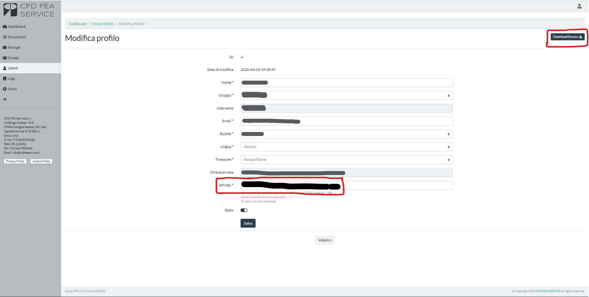

# API V1 INTRODUCTION

The current API version is “1”. Replace the version placeholder with this number in every call below. For example, the following API:

```bash
 curl -X GET https://cloud.cfdfeaservice.it/api/v{version}/simulation \
  -H 'api-key: {api_key}' \
  -H 'Content-Type: application/json' \
  -H 'Accept: application/json'
```

becomes:

```bash
  curl -X GET https://cloud.cfdfeaservice.it/api/v1/simulation \
  -H 'api-key: {api_key}' \
  -H 'Content-Type: application/json' \
  -H 'Accept: application/json'
```

In addition, every API requires your _{api_key}_. The api_key is available on the user account page, as shown in the following image:



cloudHPC also provides a license file, a JSON file with your username and apikey, which avoids mistakes when copying and pasting the apikey.

Every API accepts the API_KEY either in the URL or in the HEADER of the call, as follows:

|Mode | API call|
| ------------- | ------------- |
|URL|curl -X GET --header 'Accept: application/json' 'https://cloud.cfdfeaservice.it/api/v{version}/simulation?api_key={api_key}|
|Header|curl -X GET https://cloud.cfdfeaservice.it/api/v{version}/simulation -H 'Accept: application/json' -H ‘api-key: {api_key}’|

We recommend passing the API_KEY in the HEADER. Besides this guide, more details are available at the [following link](https://cloud.cfdfeaservice.it/api/v1/explorer). A complete client using the API is available in the [exampleAPI folder](https://github.com/CFD-FEA-SERVICE/CloudHPC/tree/master/exampleAPI) of our repository.


## SIMULATION LIST
This API call returns the full list of the simulations launched by the user.

```bash
  curl -X GET https://cloud.cfdfeaservice.it/api/v{version}/simulation \
  -H 'api-key: {api_key}' \
  -H 'Content-Type: application/json' \
  -H 'Accept: application/json'
```

The JSON data returned are described below:

| JSON fields| JSON value | Description |
|------------|------------|-------------|
|  "id"| 1| | 
|  "mdate"| "2019-04-12 20:05:08"| |
|  "user_id"| 1| |
|  "bucket"| "bucket_name"| |
|  "cpu"| 1  | N. of cores used |
|  "ram"| "standard"  | RAM used |
|  "nopre"| 0| |
|  "folder"| "FOLDER_NAME" | FOLDER in the bucket |
|  "mesh"| null| |
|  "script"| "codeAster-13.4" | Software used |
|  "clean"| 0| |
|  "idate"| "2019-04-12 20:05:08" | Start date |
|  "edate"| "2019-04-12 20:05:15" | End date |
|  "status"| 60 | STATUS [See legend below] |
|  "pid"| 25979| |
|  "tid"| null| |
|  "output"| "", | LOG |
|  "images"| [] |Images [i.e. residuals, cpu, …] |

### SIMULATION STATUS
| CODE | NAME | Description |
|------|------|-------------|
|10    | COMPLETED | analysis terminated correctly |
|60    | ERROR     | analysis terminated with errors |
|20    | PENDING   | analysis submitted and waiting for the system to start it |
|30    | RUNNING   | analysis in progress |
|50    | STOPPED   | analysis terminated because of a “STOP” signal |
|40    | STOPPING  | analysis terminating due to a “STOP” signal |

### DATA OF A SINGLE SIMULATION
You can also get the details of a single simulation using its ID. The data returned are the same as described above.

```bash
  curl -X GET 'https://cloud.cfdfeaservice.it/api/v{version}/simulation/{id} \
-H 'api-key: {api_key}' \
-H 'Accept: application/json' 
```

The data returned are the same as described in the previous section.

## POST NEW SIMULATION
To launch a simulation:

```bash
  curl -X POST https://cloud.cfdfeaservice.it/api/v{version}/simulation \
  -H 'api-key: {api_key}' \
  -H 'Content-Type: application/json' \
  -H 'Accept: application/json' \
  -d '{
        "data": { 
                "cpu": "{cpu}",
                "ram": "{ram}",
                "folder": "{folder}",
                "script": "{script}"
        } 
}'
```

The response body of this API is the ID of the launched simulation.

### Arguments vCPU, RAM, SCRIPTs
To retrieve the vCPU/RAM/SCRIPT values available to run a simulation, use the following APIs:

```bash
  curl -X GET https://cloud.cfdfeaservice.it/api/v{version}/simulation/cpu \
                         -H "api-key: {api_key}" \
                   --header 'Accept: application/json'

  curl -X GET https://cloud.cfdfeaservice.it/api/v{version}/simulation/ram \
                         -H "api-key: {api_key}" \
                   --header 'Accept: application/json'

  curl -X GET https://cloud.cfdfeaservice.it/api/v{version}/simulation/scripts \
                         -H "api-key: {api_key}" \
                   --header 'Accept: application/json'
```

The last argument is the FOLDER where the simulation runs. You can get it with the [storage navigation](#navigation) API, once at least one folder has been uploaded.

### REG and SPOT instances
Users with the REG/SPOT selection enabled can choose the instance type by adding the _**nopre**_ property to the "data" section of the JSON input.

The possible selections are:

* _"nopre": 0_ -> uses SPOT instance type
* _"nopre": 1_ -> uses REGULAR instance type

To run a simulation on a SPOT instance, use the following command:

```bash
  curl -X POST https://cloud.cfdfeaservice.it/api/v{version}/simulation \
  -H 'api-key: {api_key}' \
  -H 'Content-Type: application/json' \
  -H 'Accept: application/json' \
  -d '{
        "data": { 
                "cpu": "{cpu}",
                "ram": "{ram}",
                "folder": "{folder}",
                "script": "{script}",
                "nopre": 0
        } 
}'
```

## RUNTIME CONTROL
At any time you can send runtime commands to control the process. The runtime options are:

* HARD STOP: kills the simulation without saving anything to the storage. To call it:

```bash
  curl -X PUT https://cloud.cfdfeaservice.it/api/v{version}/simulation/{id}/stop \
  -H 'Accept: application/json' \
  -H 'api-key: {api_key}' \
  -d '{
        "data": {
                "signal": "SIGINT"
        }
}'
```

* SOFT STOP: stops the simulation at the current iteration and saves the results. To call it:

```bash
curl -X PUT https://cloud.cfdfeaservice.it/api/v{version}/simulation/{id}/stop \
  -H 'Accept: application/json' \
  -H 'api-key: {api_key}' \
  -d '{
        "data": {
                "signal": "SIGTSTP"
        }
}'
```

Note that a SOFT STOP can take several minutes to complete, since it involves stopping the executable, saving the current iteration and uploading everything to the storage, among other tasks.

* SYNC: saves the current results to the storage and continues the simulation. To call it:

```bash
curl -X PUT https://cloud.cfdfeaservice.it/api/v{version}/simulation/{id}/sync \
  -H 'Accept: application/json' \
  -H 'api-key: {api_key}' \
  -d '{ 
        "data": { 
                "signal": "SIGQUIT" 
        } 
}'
```

## UPLOAD OF FILE
Uploading or downloading a file to or from the cloud storage takes two steps: first you request a URL to upload/download the file, then you upload/download the file itself. To request an upload URL:

```bash
curl -X POST https://cloud.cfdfeaservice.it/api/v{version}/storage/upload/url \
  -H 'api-key: {api_key}' \
  -H 'Content-Type: application/json' \
  -H 'Accept: application/json' \
  -d '{
        "data": {
                "dirname": "{dirname}",
                "basename": "{filename}",
                "contentType": "application/octet-stream"
        }
}'
```

In this call, dirname is the directory where the file will be stored, and basename is the file name on the server. The API returns a URL, to be used in the following call to upload the file:

```bash
curl -X PUT -H 'Content-Type: application/octet-stream' \
  -T {path_to_filename} {upload_url}
```

### DIRECT UPLOAD OF SINGLE FILE
To upload a single file, you can speed up the process with this single call:

```bash
curl -X POST https://cloud.cfdfeaservice.it/api/v{version}/storage \
  -H "api-key: {api_key}" \
  -H 'Content-Type: multipart/form-data' \
  -H 'Accept: application/json' \
  -F dirname={dirname} \
  -F basename=@{path_to_filename}
```

It returns a JSON summarising the information of the uploaded file.

**N.B.: this upload only works for files smaller than 2 MB**


## NAVIGATION
To navigate the storage, use the following method:

```bash
curl -X GET https://cloud.cfdfeaservice.it/api/v{version}/storage/{id}/list \
-H 'api-key:{api_key}' \
--header 'Accept: application/json' 
```

_{id}_ is the id of a directory: the call returns its content. With _{id}_ = 0 you get the content of the root folder. Alternatively, you can query a single file/folder by its name and location, as follows.

```bash
curl -X POST https://cloud.cfdfeaservice.it/api/v{version}/storage/view \
-H 'api-key: {api_key}' \
-H 'Content-Type: application/json' \
-H 'Accept: application/json' \
-d '{ "data": { "path": "{path}" } }'
```

With this last method, you can pass the folder name exactly as returned by the [simulation list](#simulation_list) API call, to see the files contained in the case folder.

## ALL FILES AND FOLDERS INFO
To retrieve the information of ALL the files in the storage, use the following command:

```bash
curl -X GET https://cloud.cfdfeaservice.it/api/v{version}/storage \
-H 'api-key:{api_key}' \
--header 'Accept: application/json'
```

The resulting JSON may be large, so use it with care!

## SINGLE FILE INFO
You can also get all the information of a single file with:

```bash
curl -X GET https://cloud.cfdfeaservice.it/api/v{version}/storage/{id} \
-H 'api-key:{api_key}' \
--header 'Accept: application/json' 
```

where, as before, _{id}_ is the file ID.

## DOWNLOAD
As for uploads, downloading a file takes two calls: the first one returns a URL from which the file can be downloaded. The file is identified by its ID:

```bash
curl -X GET https://cloud.cfdfeaservice.it/api/v{version}/storage/{id}/download/url \
  -H 'api-key: {api_key}' \
  -H 'Content-Type: application/json' \
  -H 'Accept: application/json'
```

This call returns a URL, which you can use to download the file with:

```bash
curl -X GET {download_url} -L -o {path_to_filename}
```

### DIRECT DOWNLOAD OF FILE
To speed up the process, you can also download a file with a single API call, which combines the two above:

```bash
curl -X GET https://cloud.cfdfeaservice.it/api/v{version}/storage/{id}/download/file \
  -H 'api-key: {api_key}' \
  -H 'Content-Type: application/json' \
  -H 'Accept: application/json'
```

Once again, _{id}_ is the ID of the file.

## DELETE FILE OR FOLDER
To delete a single file [or folder] from the storage, retrieve its ID with the calls described above and then use the following API:

```bash
curl -X DELETE https://cloud.cfdfeaservice.it/api/v{version}/storage/{id} \
  -H 'api-key: {api_key}' \
  -H 'Accept: application/json'
```

The file [or folder] _{id}_ can be found with the storage navigation methods.
