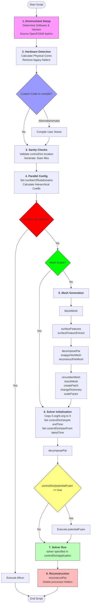

# Executions

This section of the guide aims at showing the graphs of the scripts executions as provided by the system. 

## OpenFOAM

```mermaid
graph TD
    Start([Start Script]) --> EnvSetup[<b>1. Environment Setup</b><br/>Determine Software & Version<br/>Source OpenFOAM bashrc]
    
    EnvSetup --> Hardware[<b>2. Hardware Detection</b><br/>Calculate Physical Cores<br/>Remove legacy folders]
    
    Hardware --> Compilation{Custom Code to compile?}
    Compilation -- Allwmake/wmake --> Compile[Compile User Solver]
    Compilation -- No --> SanityCheck[<b>3. Sanity Checks</b><br/>Validate controlDict location<br/>Generate .foam files]
    
    Compile --> SanityCheck
    
    SanityCheck --> Decompose[<b>4. Parallel Config</b><br/>Set numberOfSubdomains<br/>Calculate Hierarchical Coeffs]
    
    Decompose --> Allrun{Is Allrun file present?}
    Allrun -- Yes --> ExecAllrun[Execute Allrun]
    Allrun -- No --> MeshCheck{Mesh Exists?}

    MeshCheck -- No --> MeshGen[<b>5. Mesh Generation</b>]
    MeshGen --> BlockMesh[blockMesh]
    BlockMesh --> SurfaceFeature[surfaceFeatures<br/>surfaceFeatureExtract]
    SurfaceFeature --> Snappy[decomposePar<br/>snappyHexMesh<br/>reconstructParMesh]
    Snappy --> MeshVerification[renumberMesh<br/>checkMesh<br/>createPatch<br/>changeDictionary<br/>scaleFactor]
    
    MeshCheck -- Yes --> SolverInit[<b>6. Solver Initialization</b><br/>Copy 0.org/0.orig to 0<br/>Set controlDict/stopAt endTime<br/>Set controlDict/startFrom latestTime]

    MeshVerification --> SolverInit
    SolverInit --> SolverDecompose[decomposePar]
    SolverDecompose --> Potential{controlDict/potentialFoam == true}
    
    Potential -- Yes --> PotExec[Execute potentialFoam]
    Potential -- No --> SolveLoop

    PotExec --> SolveLoop[<b>7. Solver Run</b><br/>solver specified in controlDict/application]
    
    SolveLoop --> Recon[<b>9. Reconstruction</b><br/>reconstructPar<br/>Delete processor folders]
    
    ExecAllrun --> End([End Script])
    Recon --> End([End Script])

    %% Styling
    style EnvSetup fill:#f9f,stroke:#333
    style Compilation fill:#99f,stroke:#333
    style MeshCheck fill:#0f0,stroke:#333
    style Allrun fill:#f00,stroke:#333
    style Potential fill:#ff8,stroke:#333
    style SolveLoop fill:#bfb,stroke:#333
    style Recon fill:#fbb,stroke:#333
```
