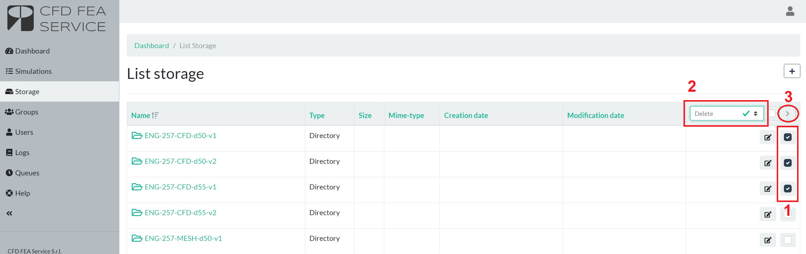

# Storage

The STORAGE is a cloud deposit for your input files and results. Hence, they will be available in the web-app for you to download and modify. Once the input file[s] to run is completed in local, it should be uploaded in the Web-App through your own CFD FEA SERVICE account. 

In the STORAGE list you can:

* Upload a file

* Modify a file

* Duplicate a folder

* Download a file and simulation results

* Delete a file

!!! warning
    The STORAGE is not intended for long term archiving. Files are deleted after 60 days automatically by the system **with NO possibility of restoring them**.

## Upload of a file
You can upload a single file on the STORAGE of the platform by entering the "STORAGE" page and then clicking on "Add".

   

In the new page you have three different options to select:

* **Dirname drop-down menu**: this menu allows to select the folder where you want to save your file. The root element "/" represents the base element of the storage from which you can find all the nested directories.
* **Dirname text box**: this menu allows to create a new folder where the file is going to be uploaded. You just have to enter the folder name keeping in mind the folder location is specified in the _Dirname drop-down menu_. Special characters such as *, ?, $, etc. are not accepted in folder names.
* **File box**: the are where you can drag-and-drop your files or, alternatively, click on "Add more" to add more files.

   

After setting all the parameters of this page, you can press "Save" at the bottom to actually upload the file and save it on your own storage.

## Upload of a folder
Currently the platform does not allow to upload a whole folder, in particular when subfolders are present. To actually achieve this we recommend to use compressed files in one of the many formats accepted: _rar_, _zip_, _tar.gz_, _7z_, _xy_. More file format are implemented and in case you can make a request to the support to add a specific one.

Compressed files, regardless of their format, need to be compliant with one of the two methodologies accepted, which differs on the definition of case folder directory. Make sure you follow one of the two methods.

### Upload of a locally compressed folder
* Create in your computer a **folder** in which all the input files and folders are collected.

* Compress the **folder** in one of the accepted file formats. As a result, when you open your compressed folder there should be another folder in which are collected the input files.

* Make sure your **file name exactly match the folder name contained** inside of the file followed by the file extension.

   

 
* Upload the compressed folder. In this case, it is necessary to upload the compressed file without inserting it in a folder in the Web-app. This is possible if you upload the file without inserting a string in the Dirname text box.

   

 
When the simulation is started, the file will be extracted, and the web-app automatically creates a folder for the results in the STORAGE. The following video shows you the main possibilities to upload a whole folder on the storage using a compressed file.

   

### Upload compressed files inside a folder created in the web-app
* Compress in your local computer all files/folders you want to upload.

* Make sure that once you open the compressed file you **directly access the input file/folders** without their root folder.

   

 
* Upload the compressed file in the STORAGE list, **inserting it in a folder** directly created in the web-app by entering the folder name on the Dropdown text box.

   

### Correct storage with compressed files
If the compressed files are uploaded correctly for method 1 and 2, the uploaded files should appear in your STORAGE list as shown below.

   

## Edit an existing file
It is possible to edit a file which is already present in the storage. To do so just go to the file directory and click on the "Edit" icon as in the following image:

   

Once the file opens you can edit:

1. Dirname to modify its location
1. Name to modify the filename
1. Content to modify the file content [available only for certain file formats only]

   

Click "Save" to save the updates.

## Duplicate a folder
In case a copy of an existing case has to run with modified settings, it is possible to duplicate a folder in your storage using the _Copy_ functionality. This generates a new folder with the pedix _\_copy_ as highlighted by the following image.

   

## Download results
The CloudHPC makes the results of your simulations available through the STORAGE. Inside of it, you can find the folder chosen when running a simulation and, inside of this folder, the results of the analysis. Results are created and uploaded in the STORAGE folder on these conditions:

1. At the end of every simulation RUN (regardless of the final simulation status)
1. Every 10 hours of simulation RUN
1. When user clicks the "SYNC" button as showed in the following image.

   

By pressing SYNC on the simulation LOG you can find a specific log line saying partial result is being generated and uploaded onto the storage.

   

 
In order to download the results, you should open the folder in the storage and download the single results’ file, which is the following for each software:

* FDS.tar.gz

* OPENFOAM-solution.tar.gz
* OPENFOAM-constant.tar.gz
* OPENFOAM-system.tar.gz

* SATURNE-solution.tar.gz

* CODE-ASTER.tar.gz

* CALCULIX.tar.gz

* OPENRADIOSS.tar.gz

   

### Handle tar.gz files on Windows
tar.gz files are compressed archive. This file format is being used because of its high capability of reducing the size of the files to download. There are specific software you can install on Windows to unpack the content of these files. Some of them are:

* [7zip](https://www.7-zip.org/download.html)
* [WinRar](https://www.win-rar.com/download.html?&L=11)
* [WinZip](https://www.winzip.com/it/download/winzip/)

Please make sure your computer has at least one archive manager installed before moving further. Once you finish download tar.gz file from the storage, to uncompress it just right click on the file and go to the archive manager (like 7zip in the example below) and select "Extract here" in the sub-window it appears. 

   

Some archive managers, such as 7zip among the ones suggested, after needs a double extraction: the first extraction is able to unpack the .gz file format and generates a .tar file, while the second extraction unpacks the .tar file.

## Delete old files
!!! danger
    The files in the STORAGE list would be automatically deleted by the system within 60 days from creation. This process is needed in order to clear the space used and make it again available. The whole application, consequently, is not intended for remote storage of data. For this, it is recommended to download your files and results when the simulation is completed.

At any time the user can delete old simulations files or folders by using the queuing system. To do that, first select the files and folders to delete, then apply the 'DELETE' action and finally submit the job.

!!! note
    Once the deletion process has been submitted, it takes few seconds to actually delete the files. Just wait for it to finish before submitting new DELETE.
