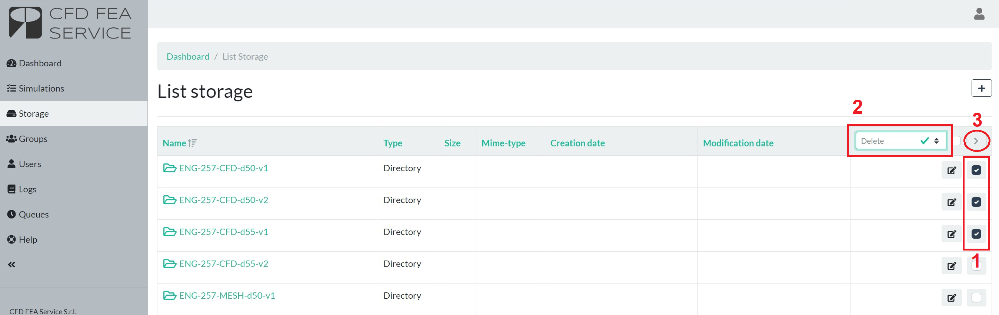

# Storage

The STORAGE is a cloud repository for your input files and results, where you can download and modify them from the web app. Once your input files are ready on your local computer, upload them to the web app through your CFD FEA SERVICE account.

From the STORAGE list you can:

* upload a file

* modify a file

* duplicate a folder

* download files and simulation results

* delete a file

!!! warning
    The STORAGE is not intended for long-term archiving. Files are automatically deleted by the system after 60 days, **with NO possibility of restoring them**.

!!! note
    Not sure how to organise your case folder? The [ready-to-run examples](https://github.com/CFD-FEA-SERVICE/CloudHPC/tree/master/exampleCloudHPC) show the expected folder layout for each solver, and can be uploaded as they are to test your account.

## Upload of a file
To upload a single file to the STORAGE, open the "STORAGE" page and click "Add".

   

The new page has three fields:

* **Dirname drop-down menu**: selects the folder where the file will be saved. The root element "/" is the base of the storage, which contains all the nested folders.
* **Dirname text box**: creates a new folder where the file will be uploaded. Just type the folder name: the new folder is created inside the one selected in the _Dirname drop-down menu_. Special characters such as *, ?, $, etc. are not allowed in folder names.
* **File box**: the area where you can drag and drop your files or, alternatively, click "Add more" to add more files.

   

Once all the fields are set, press "Save" at the bottom of the page to upload the file to your storage.

## Upload of a folder
The platform does not currently allow uploading a whole folder, in particular one containing subfolders. To do this, we recommend using a compressed archive in one of the many accepted formats: _rar_, _zip_, _tar.gz_, _7z_, _xz_. If you need a format that is not supported yet, you can ask our support team to add it.

Whatever its format, the compressed file must follow one of the two methods below, which differ in how the case folder is defined. Make sure you follow one of them.

### Upload of a locally compressed folder
* On your computer, create a **folder** containing all the input files and subfolders.

* Compress the **folder** in one of the accepted formats. When you open the archive, you should see the folder, and inside it the input files.

* Make sure the **archive name exactly matches the name of the folder it contains**, followed by the file extension.

   

 
* Upload the archive **without placing it in a folder** in the web app, that is, leave the Dirname text box empty.

   

 
When the simulation starts, the archive is extracted and the web app automatically creates a folder for the results in the STORAGE. The following video shows the main ways to upload a whole folder to the storage using a compressed file.

   

### Upload compressed files inside a folder created in the web app
* On your local computer, compress all the files and folders you want to upload.

* Make sure that when you open the archive you **directly see the input files and folders**, without a root folder around them.

   

 
* Upload the archive to the STORAGE **inside a folder** created directly in the web app, by typing the folder name in the Dirname text box.

   

### Correct storage with compressed files
If the archive has been uploaded correctly with either method, the uploaded files appear in your STORAGE list as shown below.

   

## Edit an existing file
You can edit a file that is already in the storage. Open the file's folder and click the "Edit" icon, as shown in the following image:

   

Once the file is open you can change:

1. Dirname, to move the file
1. Name, to rename the file
1. Content, to modify the file content [available for some file formats only]

   

Click "Save" to save the changes.

## Duplicate a folder
If you need to run a copy of an existing case with different settings, you can duplicate a folder in your storage with the _Copy_ function. This creates a new folder with the suffix _\_copy_, as highlighted in the following image.

   

## Download results
cloudHPC makes the results of your simulations available in the STORAGE: they are saved in the folder you selected when launching the simulation. Results are generated and uploaded to the STORAGE folder:

1. at the end of every simulation RUN (whatever the final simulation status)
1. every 10 hours while the simulation is RUNNING
1. when you click the "SYNC" button, as shown in the following image.

   

After pressing SYNC, the simulation LOG shows a line stating that partial results are being generated and uploaded to the storage.

   

 
To download the results, open the folder in the storage and download the results file, which depends on the software:

* FDS.tar.gz

* OPENFOAM-solution.tar.gz
* OPENFOAM-constant.tar.gz
* OPENFOAM-system.tar.gz

* SATURNE-solution.tar.gz

* CODE-ASTER.tar.gz

* CALCULIX.tar.gz

* OPENRADIOSS.tar.gz

   

### Handle tar.gz files on Windows
tar.gz files are compressed archives. This format is used because it greatly reduces the size of the files to download. Several programs can extract these files on Windows, for example:

* [7zip](https://www.7-zip.org/download.html)
* [WinRar](https://www.win-rar.com/download.html?&L=11)
* [WinZip](https://www.winzip.com/it/download/winzip/)

Make sure at least one archive manager is installed on your computer before moving on. Once the tar.gz file has been downloaded from the storage, right-click it, open the archive manager menu (7zip in the example below) and select "Extract here".

   

Some archive managers, such as 7zip, need two extractions: the first one unpacks the .gz file and creates a .tar file, the second one unpacks the .tar file.

## Delete old files
!!! danger
    Files in the STORAGE list are automatically deleted by the system 60 days after their creation, to free up the space they use. The application is therefore not intended for long-term data storage: download your files and results once the simulation has completed.

You can delete old simulation files or folders at any time using the queuing system: select the files and folders to delete, choose the 'DELETE' action and submit the job.

!!! note
    Once the deletion has been submitted, it takes a few seconds for the files to be deleted. Wait for it to finish before submitting a new DELETE.
